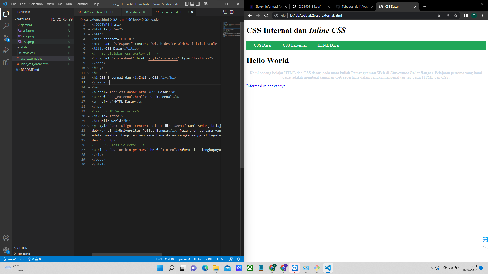

# weblab2
### Membuat css internal
Pertama membuat html dasar dan membuat paragraf
seperti gambar dibawah

lalu memasukan style internal didalam kode html
seperti gambar dibawah

kemudian menambahkan style inline pada paragraf
seperti gambar dibawah

### Membuat External CSS
Pertama membuat file didalam folder `style` lalu beri nama `style.css` kemudian mebuat kode css di dalam file tersebut.
Seperti gambar dibawah

lalu menambah kan style pada menu konten
seperti gambar dibawah

### Perubahan pada css
perubahan akhir style pada tampilan website
seperti gambar dibawah
